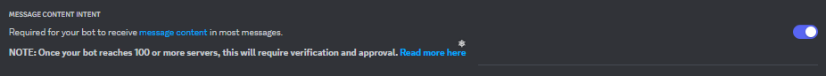
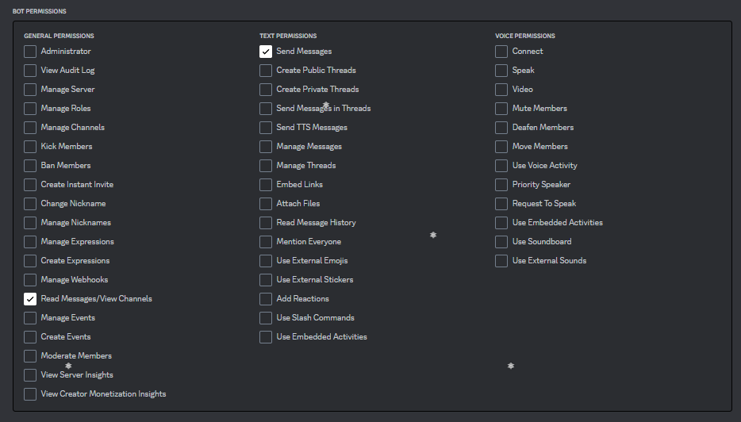

# Alliance Squawk

A discord bot which monitors alliance corporations and notifies a channel once a corporation
join or leave an alliance.

## Bot Permissions
The bot need permissions to post messages with content. These permissions is viable when deploying the bot.

### Message Content Intent

### Permissions

## Configuration

The bot is configured using environment variables. These are the available options:
| Variable          | Description                                                    | Required |
| ----------------- | -------------------------------------------------------------- | -------- |
| DISCORD_TOKEN     | The discord token.                                             | true     |
| NOTIFY_CHANNEL_ID | ID of the discord channel where notification should be posted. | true     |

The environment variables can be placed inside a `.env` file inside the application working directory.
